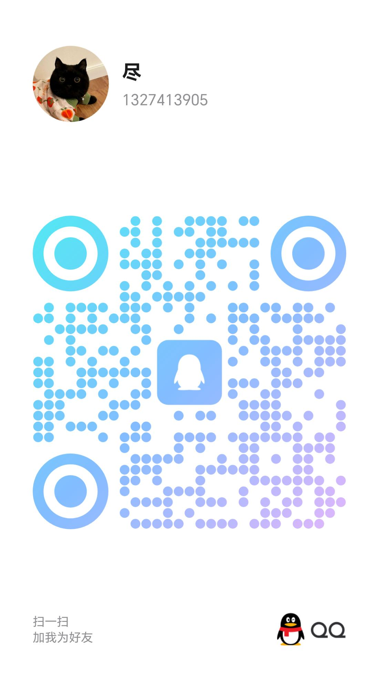

---
hero:
  title: React Haki
  description: An amazing react components library with hooks
  actions:
    - text: 开始使用
      link: /guide
    - text: 组件列表
      link: /components/foo
features:
  - title: 高性能
    emoji: 🚀
    description: 无需配置，即可拥有最佳的包体积大小和极致的性能
  - title: 可定制
    emoji: 🌈
    description: 可以高效地对组件外观进行调整或创造自己的主题
  - title: 原子化
    emoji: 💎
    description: 每个组件的功能不多也不少，恰好就是你所需
---

# 反馈与共建

请访问 [GitHub](https://github.com/coderwang/react-haki) 或联系我：

